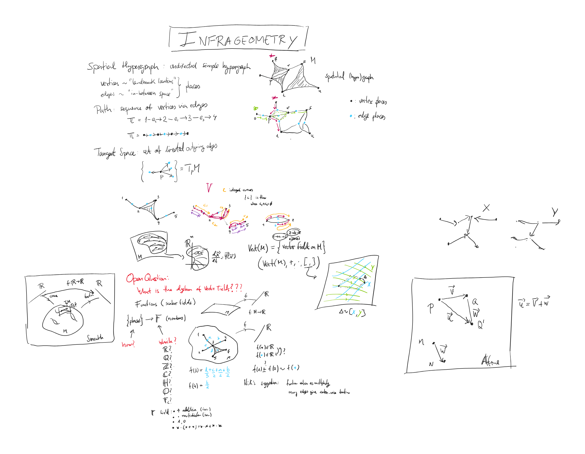

# Infrageometry

> ⚠️ **Actively developed, experimental research code.** It undergoes frequent cleanings and refactors, and the API may change without notice.

Discrete geometry of combinatorial objects — complexes, hypergraphs, Hodge/Dirac calculus, Forman–Ricci curvature, simplicial maps, and differential forms on graphs.

## ✨ Usage

Install from the Wolfram Cloud:

```wolfram
PacletInstall["https://www.wolframcloud.com/obj/hajek_pavel/Infrageometry.paclet", ForceVersionInstall -> True]
Needs["WolframInstitute`Infrageometry`"]
```

Test on **[Example graphs](https://www.wolframcloud.com/obj/hajek_pavel/ExampleGraphs.nb)**


## 📓 Research Notebooks

| Notebook | Description | Link |
|---|---|---|
| Forms and cochains | Forms as wedge products of incident edges vs. cochains on the clique complex | [Wolfram Cloud](https://www.wolframcloud.com/obj/hajek_pavel/Infrageometry/FormsAndCochains.nb) |
| Homotopy transfer on graph cochains | A-infinity products, Massey products, and the transfer to cohomology from one Hodge contraction | [Wolfram Cloud](https://www.wolframcloud.com/obj/hajek_pavel/Infrageometry/AInfinityTransfer.nb) |
| Vectors and displacements | Algebra of discrete vector fields and their flows | [Wolfram Cloud](https://www.wolframcloud.com/obj/hajek_pavel/Infrageometry/Displacements.nb) |
| Simplicial sets and face graphs | Simplicial sets and the face graphs of complexes | Wolfram Cloud |
| Regular and uniform tessellation graphs | Regular maps and uniform tilings of surfaces, as graphs | Wolfram Cloud |

## 🎨 Founding Sketch


